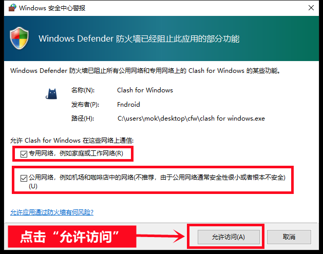

# Clash For Windows 使用教程

## 1. 安装 Clash
- 下载完成后，直接运行安装程序。
- 安装完毕后，在桌面找到 Clash 图标，以**管理员身份运行**。
- *注意*：首次运行可能会弹出 Windows 安全中心警报，按照提示勾选“允许访问”即可。

 

## 2. 获取订阅地址
- 打开 Clash 主页面，复制你的订阅地址。

## 3. 添加订阅
- 在 Clash 中粘贴订阅地址，添加订阅。
- *提示*：如果下载配置文件时出现“Network Error”错误，请尝试更换 Wi-Fi 网络，或通过手机的 4G/5G 热点连接网络。

 

## 4. 选择订阅
- 订阅添加成功后，在下拉菜单中选择你下载的订阅。

 

## 5. 选择代理节点
- 进入“代理”页面，挑选一个适合的节点。

 
 

## 6. 连接节点
- 选好节点后，点击启动连接。
- 连接成功后，界面会显示相应状态。

 

## 7. 开始使用
- 连接成功后，你就可以开始上网冲浪了！

 

## 系统要求
- **仅支持 Windows 10 及以上系统**。
- 可能存在兼容性问题，不保证适配所有操作系统。如果连接后无法翻墙，请尝试更换其他 Windows 客户端。